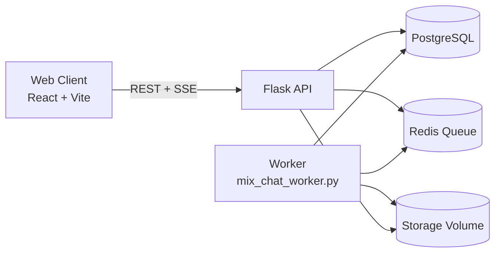

# IntelliMix

[](https://github.com/pulkitpareek18/IntelliMix/actions/workflows/ci.yml)
[](https://github.com/pulkitpareek18/IntelliMix/actions/workflows/main.yml)


## Release Snapshot (March 2026)

- Status: Active
- Type: AI-first music mixing platform
- Live app: https://intellimix.geturstyle.in
- CI checks: Python dependency/syntax checks + frontend build

## Demo Card

[](https://intellimix.geturstyle.in)

AI-first music mixing studio with a chat-native workflow for planning, revising, and rendering mashups.

IntelliMix combines conversational intent understanding, draft-based planning, timeline-aware editing, and asynchronous rendering into a single product experience.

## Table of Contents

- [Why IntelliMix](#why-intellimix)
- [Core Capabilities](#core-capabilities)
- [Architecture](#architecture)
- [Tech Stack](#tech-stack)
- [Getting Started](#getting-started)
- [Configuration](#configuration)
- [API Overview](#api-overview)
- [Realtime Run Updates](#realtime-run-updates)
- [Project Structure](#project-structure)
- [Development Workflow](#development-workflow)
- [Testing](#testing)
- [Deployment Notes](#deployment-notes)
- [Security](#security)
- [Troubleshooting](#troubleshooting)
- [Contributing](#contributing)
- [License](#license)

## Why IntelliMix

Most AI audio tools are either:
- prompt-only (low control), or
- DAW-heavy (high control, high complexity).

IntelliMix sits in the middle: conversational UX with explicit, reviewable planning artifacts (drafts, constraints, versions, timeline attachments) before final render.

## Core Capabilities

- Chat-first mix generation with iterative refinement
- Planning drafts with structured revision loops
- Timeline attachment + conflict-aware resolution flow
- Versioned outputs and immutable chat history
- Personalized suggestions using optional user memory signals
- Async run processing via queue/worker pattern
- Realtime run status via SSE, with polling fallback
- Authenticated user history and secured file retrieval

## Architecture



Runtime responsibilities:
- `app.py`: API surface, auth, run orchestration entry points, SSE endpoints
- `mix_chat_runner.py`: planning/refinement/render orchestration logic
- `mix_chat_queue.py`: queue abstraction over Redis
- `mix_chat_worker.py`: background run executor

## Tech Stack

Frontend:
- React 18, TypeScript, Vite
- React Router
- Tailwind CSS
- Three.js / React Three Fiber

Backend:
- Flask, SQLAlchemy, Flask-JWT-Extended
- Redis (queue)
- Gunicorn
- pydub, moviepy, pytubefix
- Google Gemini (`google-genai`)

Infrastructure:
- Docker Compose (dev + production-style stacks)

## Getting Started

## Prerequisites

- Docker Desktop (recommended), or
- Python 3.12+ and Node 20+ for local manual setup

## Option A: Development Stack (Hot Reload)

Use this during feature work.

```bash
docker compose -f docker-compose.dev.yml --env-file .env.docker up --build
```

Default URLs:
- Frontend: `http://localhost:5173`
- Backend: `http://localhost:5001`

Stop:

```bash
docker compose -f docker-compose.dev.yml --env-file .env.docker down
```

## Option B: Production-Style Stack

Use this for production-like runtime behavior.

```bash
docker compose --env-file .env.docker up --build
```

Default URLs:
- Frontend: `http://localhost:8080`
- Backend: `http://localhost:5000`

Stop:

```bash
docker compose --env-file .env.docker down
```

## Option C: Run Without Docker

Backend:

```bash
cd backend
pip install -r requirements.txt
python app.py
```

Frontend:

```bash
cd frontend
npm install
npm run dev
```

## Configuration

Start from `.env.docker.example`:

```bash
cp .env.docker.example .env.docker
```

Required (production-style compose):
- `POSTGRES_PASSWORD`
- `FLASK_SECRET_KEY`
- `JWT_SECRET_KEY`
- `GOOGLE_API_KEY`

High-impact configuration knobs:

| Variable | Purpose |
|---|---|
| `DATABASE_URL` | Primary database connection |
| `FRONTEND_ORIGIN` | CORS allowlist origin |
| `MIX_CHAT_QUEUE_URL` | Redis connection for queue |
| `MIX_CHAT_QUEUE_KEY` | Queue key for run IDs |
| `MIX_CHAT_WORKER_POLL_SECONDS` | Worker dequeue poll interval |
| `MIX_CHAT_SSE_POLL_SECONDS` | SSE refresh cadence |
| `MIX_CHAT_SSE_HEARTBEAT_SECONDS` | SSE keepalive interval |
| `MIX_CHAT_SSE_MAX_SECONDS` | SSE stream max duration |
| `VITE_MIX_CHAT_SSE_ENABLED` | Enables client SSE subscription |
| `AI_ENABLE_GUIDED_SONG_SUGGESTIONS` | AI-guided song suggestion mode |
| `AI_ENABLE_ADAPTIVE_PLANNING_QUESTIONS` | Dynamic planning-question generation |
| `AI_USER_MEMORY_ENABLED` | Memory-driven personalization controls |

For backend-only local setup, refer to `backend/.env.example`.

## API Overview

Base path: `/api/v1`

Auth:
- `POST /auth/register`
- `POST /auth/login`
- `POST /auth/refresh`
- `POST /auth/logout`
- `GET /auth/me`

Mix sessions (legacy + utility):
- `POST /mix-sessions/plan`
- `GET /mix-sessions`
- `GET /mix-sessions/<session_id>`
- `POST /mix-sessions/<session_id>/finalize`

Mix chats (primary workflow):
- `POST /mix-chats`
- `GET /mix-chats`
- `DELETE /mix-chats/<thread_id>`
- `GET /mix-chats/<thread_id>/messages`
- `POST /mix-chats/<thread_id>/messages`
- `GET /mix-chats/<thread_id>/versions`
- `POST /mix-chats/<thread_id>/versions/<version_id>/render`
- `POST /mix-chats/<thread_id>/versions/<version_id>/edit-runs`
- `GET /mix-chats/<thread_id>/plan-drafts/<draft_id>`

Run status:
- `GET /mix-chat-runs/<run_id>`
- `GET /mix-chat-runs/<run_id>/events` (SSE)

History + files:
- `GET /history`
- `GET /history/<job_id>`
- `DELETE /history/<job_id>`
- `GET /files/<job_id>/<filename>`

Additional processing endpoints (supported):
- `POST /process-array`
- `POST /process-csv`
- `POST /generate-ai`
- `POST /download-video`
- `POST /download-audio`

## Realtime Run Updates

IntelliMix uses a dual strategy:
- Primary: Server-Sent Events (SSE) stream per run (`/events`)
- Fallback: polling snapshots when SSE is disabled/unavailable

Client states exposed in UI:
- `queued`
- `running`
- `completed`
- `failed`

## Project Structure

```text
backend/
  ai/                     # AI instructions, model client logic, planning helpers
  features/               # media processing helpers
  tests/                  # backend test suite
  app.py                  # Flask app and routes
  mix_chat_runner.py      # run orchestration (planning/revision/render)
  mix_chat_queue.py       # Redis queue interface
  mix_chat_worker.py      # worker loop

frontend/
  src/pages/              # route screens (AIParody, auth, history, tools)
  src/components/         # UI components
  src/context/            # auth context and hooks
  src/utils/              # API and shared utilities

infra/
  docker-compose.yml      # production-style stack
  docker-compose.dev.yml  # hot-reload dev stack
```

## Development Workflow

Frontend:

```bash
cd frontend
npm run lint
npm run build
```

Backend (local):

```bash
cd backend
pytest -q tests
```

Backend (containerized, recommended in this repo):

```bash
docker compose -f docker-compose.dev.yml --env-file .env.docker run --rm -e PYTHONPATH=/app backend pytest -q tests
```

## Testing

Current backend suite includes coverage for:
- auth and history behavior
- mix chat API behavior
- song suggestion and timeline resolution logic
- AI and selection helper pathways

Run all tests:

```bash
docker compose -f docker-compose.dev.yml --env-file .env.docker run --rm -e PYTHONPATH=/app backend pytest -q tests
```

## Deployment Notes

- Production compose is configured to fail fast when required secrets are missing.
- Use managed Postgres/Redis and persistent storage in production.
- Keep worker and API scaled independently.
- Store generated media in object storage for multi-instance horizontal scale.
- Monitor AI provider quota/rate limits for stable planning UX.

## Security

- Never commit secret `.env` files.
- Rotate `FLASK_SECRET_KEY`, `JWT_SECRET_KEY`, and provider API keys regularly.
- Restrict `FRONTEND_ORIGIN` to your trusted domain(s).
- Terminate TLS at your ingress/reverse proxy.
- Keep dependency versions patched and run periodic scans.

## Troubleshooting

`AI_RATE_LIMITED` / `AI_TEMPORARILY_UNAVAILABLE`:
- Check API key quota/billing
- Tune retry envs: `GEMINI_MAX_RETRIES`, `GEMINI_RETRY_BASE_SECONDS`, `AI_GUIDED_RATE_LIMIT_*`

Runs remain queued:
- Verify Redis health
- Verify worker process/container is running
- Confirm queue URL/key match between API and worker

SSE progress not updating:
- Ensure `VITE_MIX_CHAT_SSE_ENABLED=true`
- Validate proxy/network path for `/api/v1/mix-chat-runs/<run_id>/events`

Frequent auth `401`:
- Check token refresh flow
- Verify backend clock and JWT expiry settings

## Contributing

1. Create a feature branch.
2. Keep pull requests focused and test-backed.
3. Run lint/build/tests before opening PR.
4. Document behavior/config changes in the PR description.

## License

A license file is not currently present in this repository.
Add a `LICENSE` before public/open distribution.
